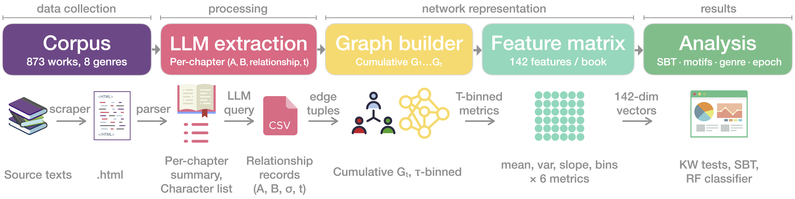

# Temporal Dynamics of Social Balance in Fictional Character Networks

[](https://github.com/L-Earthling/litnet-balance/releases/latest)
[](https://creativecommons.org/licenses/by/4.0/)
[](LICENSE)
[](https://www.python.org/)
[](thesis/Ivanova_2026_Temporal_Dynamics_Social_Balance.pdf)

> **MSc Thesis** — Larisa Ivanova · Saarland University / DFKI · 2026  
> Supervisor: Dr. rer. nat. Gerrit Großmann · Reviewers: Prof. Dr. Stefania Degaetano-Ortlieb, MSc. Sofía Aguilar

---

**TL;DR** — This repository releases the dataset, extraction pipeline, and analysis code for an MSc thesis on temporal signed character networks in literary fiction. The corpus comprises **873 works** across **8 genres** and **6 historical epochs**, yielding **109,855 character-relationship observations**. Key findings: fictional social worlds obey real-world network laws (small-world structure, superlinear densification); structural balance is persistently high, temporally flat, and genre-stratified; and entropy trajectory features carry reliable genre signal in classification.

---

## Table of Contents

1. [What Are Temporal Signed Character Networks?](#1-what-are-temporal-signed-character-networks)
2. [Dataset](#2-dataset)
3. [Key Findings](#3-key-findings)
4. [Repository Structure](#4-repository-structure)
5. [Pipeline Overview](#5-pipeline-overview)
6. [Getting Started](#6-getting-started)
7. [Citation](#7-citation)
8. [License](#8-license)

---

## 1. What Are Temporal Signed Character Networks?

Literary narratives are bounded, intentionally constructed social systems. Characters form alliances, rivalries emerge and resolve, and relationships evolve across chapters in ways that stylize real-world social dynamics.

This project operationalizes these dynamics as **temporal signed networks**: one network per literary work, updated chapter by chapter.

- **Nodes** — named characters
- **Edges** — character relationships labeled `positive`, `negative`, or `neutral`
- **Time** — chapter index, normalized to τ ∈ (0, 1]
- **Polarity convention** — *most-recent-wins*: if two characters are allies in chapter 3 but enemies in chapter 7, the edge is coded as negative from chapter 7 onward

Relationships were extracted from publicly available chapter-level book summaries using **Meta Llama-3.3-70B-Instruct** via an automated LLM pipeline.

---

## 2. Dataset

### Download

**[→ Download Dataset v1 (networks + metadata, .zip)](https://github.com/L-Earthling/litnet-balance/releases/latest)**

Or use the files directly from the `data/` folder in this repository.

### `combined_networks_all.csv` — Character relationship edges

109,855 rows × 6 columns. One row = one character-pair observation in one chapter.

| Column | Description |
|---|---|
| `Book` | `"Author: Title"` — unique book identifier |
| `Chapter` | Chapter number (1-indexed) |
| `Character A` | First character (canonical name from curated cast list) |
| `Character B` | Second character |
| `Relationship` | `positive`, `negative`, or `neutral` |
| `source` | Source platform (`sparknotes` or `litcharts`) |

### `combined_metadata_all.csv` — Per-work metadata

900 rows × 9 columns. One row per literary work.

| Column | Description |
|---|---|
| `Author` | Author name |
| `Book` | Title |
| `Year` | Year of first publication |
| `Epoch` | Historical epoch (6 categories) |
| `Genre_Primary` | Primary genre label (8 categories) |
| `Genre_Secondary` | Secondary genre label (where applicable) |
| `Form` | `Novel`, `Play`, or `Other` |
| `Remarks` | Curation notes (edge cases, non-fiction flags) |
| `source` | Source platform |

### Corpus at a glance

| Statistic | Value |
|---|---|
| Works (after quality filtering) | 873 |
| Total character-relationship observations | 109,855 |
| Authors | 544 |
| Genres | 8 |
| Historical epochs | 6 |
| Median cast size | 16 characters |
| Median chapter count | 16 |
| Median edges per work | 29 |

**Genre distribution:**

| Genre | n | Dominant form |
|---|---|---|
| Literary / Realist Fiction | 286 | Novel |
| Coming-of-Age / Bildungsroman | 107 | Novel |
| Tragedy / Drama | 85 | Play (91.8%) |
| Fantasy / Adventure | 65 | Novel |
| Science Fiction / Dystopia | 52 | Novel |
| Comedy / Satire | 48 | Play (66.7%) |
| Mystery / Thriller | 47 | Novel |
| Romance / Domestic Fiction | 36 | Novel |

> ⚠️ **Form–genre confound:** Tragedy/Drama and Comedy/Satire are play-dominated; all other genres are predominantly novels. Plays have smaller, more densely interconnected casts. Cross-genre structural comparisons involving these two genres must be interpreted with caution. See the [thesis](thesis/Ivanova_2026_Temporal_Dynamics_Social_Balance.pdf) (§VIII.3) for full discussion.

---

## 3. Key Findings

### RQ1 — Universal small-world structure and superlinear densification

Of 696 works with sufficient density, **99.3%** satisfy σ_sw > 1 (corpus median σ_sw = 2.83), confirming universal small-world structure. The corpus-wide median densification exponent is **α = 1.48** (97.1% of books yield α > 1): each newly introduced character forms, on average, more than one relationship with the existing cast — mirroring laws documented in empirical social networks.

### RQ2 — Structural balance: persistently high, temporally flat, genre-stratified

The strong-balance index B(τ) lies in [0.65, 0.84] across all genres and narrative positions, far above the B = 0.50 expectation for a randomly signed network. **No genre shows a systematic monotone trend.** Social-structural complexity is established early and maintained.

Genre differences are statistically reliable (Kruskal–Wallis H = 38.8, p = 2.1 × 10⁻⁶, η² = 0.062) but partly attributable to the play/novel form distinction. The global median per-book argmin of B(τ) falls at **τ* = 0.667**, within the Freytag climax window [0.60, 0.75] (KS non-uniformity p < 10⁻⁶).

An exploratory **U-shaped epoch effect** (ΔB ≈ 0.10–0.12) reveals that Pre-Modern and 21st-Century works occupy the highest balance band, while 19th- and Early 20th-Century works (realism and modernism) occupy the lowest — a magnitude comparable to the genre effect.

### RQ3 — Stable motifs dominate; genre-specific patterns detectable

Stable-alliance (+++) and stable-enmity (−−−) motifs together account for **76–87%** of all length-3 polarity sequences. Comedy/Satire shows the highest reconciliation rate (−−+ = 0.047); Tragedy/Drama is the only genre where antagonism rivals alliance in base rate (−−− = 0.404, +++ = 0.389).

### RQ4 — Genre classification: modest but reliable signal

Random Forest macro-F1 = **0.139** on the full corpus (stratified baseline: 0.127; L1 Logistic Regression: 0.196). Entropy trajectory features dominate the top predictors; no B(τ) features appear in the top 10. Weak classification reflects genuine structural overlap among genres, not pipeline failure.

### Validation against human annotations

Benchmarked against majority-vote human annotations from [Massey et al. (2015)](https://arxiv.org/abs/1512.00728): macro-F1 = **0.58** on 966 matched character pairs across 91 works — within the inter-annotator agreement range (κ ≈ 0.65).

---

## 4. Repository Structure

litnet-balance/
├── README.md                          # This file
├── LICENSE                            # MIT License (code)
├── LICENSE-DATA.md                    # CC BY 4.0 (dataset)
│
├── data/
│   ├── README.md                      # Data documentation
│   ├── combined_networks_all.csv      # 109,855 character-relationship edges
│   └── combined_metadata_all.csv     # 900-row per-work metadata
│
├── scripts/
│   ├── README.md                      # Script documentation and setup guide
│   ├── 6_create_text_structure.py     # Text structuring for LitCharts content
│   ├── 7_extract_networks.py          # LLM extraction pipeline (key rotation, crash resilience)
│   └── analysis/
│       └── CharDyNet_Analysis.ipynb   # Full analysis notebook (873 books)
│
├── figures/
│   ├── README.md
│   ├── pipeline_overview.png
│   ├── balance_trajectory_by_genre.png
│   ├── motif_analysis.png
│   ├── confusion_matrix.png
│   ├── feature_importance.png
│   ├── tsne_genre.png
│   ├── balance_by_epoch.png
│   ├── smallworld_sigma_distribution.png
│   └── case_studies/
│       ├── hamlet_profile.png / hamlet_heatmap.png
│       ├── pride_prejudice_profile.png / pride_prejudice_heatmap.png
│       └── great_expectations_profile.png / great_expectations_heatmap.png
│
└── thesis/
└── Ivanova_2026_Temporal_Dynamics_Social_Balance.pdf

---

## 5. Pipeline Overview



The pipeline proceeds in three stages:

**Stage 1 — Data collection.** Chapter-level narrative summaries and curated character lists are collected from online literary study guides. Each work is saved as two structured plain-text files: a summary file (partition-delimited per chapter) and a character file (MAJOR/MINOR sections).

**Stage 2 — LLM extraction** (`scripts/7_extract_networks.py`). Each chapter partition is processed by **Meta Llama-3.3-70B-Instruct** (via AcademicCloud and DeepInfra APIs), yielding signed edge tuples (A, B, σ, t) with σ ∈ {positive, negative, neutral}. The pipeline is crash-resilient (SQLite progress tracking), supports incremental resume, and rotates across multiple API keys.

**Stage 3 — Network construction and analysis** (`scripts/analysis/CharDyNet_Analysis.ipynb`). The graph builder assembles cumulative signed graphs G₁, …, G_T under a most-recent-wins convention. Per-book 142-dimensional feature vectors are extracted. Analysis blocks cover: static network metrics (A), temporal dynamics (B), structural balance (C), temporal motifs (D), densification (D), genre classification (E), epoch stratification (F), and case studies (G).

**Processing time:** approximately 132 hours total on consumer hardware (Apple MacBook Pro, M-series chip). No GPU required.

---

## 6. Getting Started

### Requirements

Python 3.12. Install dependencies:

```bash
pip install pandas numpy networkx scikit-learn matplotlib seaborn tqdm openai sqlite3
```

Or, if you have a `requirements.txt`:
```bash
pip install -r requirements.txt
```

### Load the dataset

```python
import pandas as pd

# Character-relationship edges
df = pd.read_csv("data/combined_networks_all.csv")

# Per-work metadata
meta = pd.read_csv("data/combined_metadata_all.csv")

# Merge for analysis
df_merged = df.merge(meta.rename(columns={"Book": "BookTitle"}),
                     left_on="Book",
                     right_on="BookTitle",
                     how="left")

print(f"Corpus: {df['Book'].nunique()} works, {len(df):,} edges")
```

### Reproduce the analysis

Open `scripts/analysis/CharDyNet_Analysis.ipynb` in Jupyter. Run blocks in order (Block 0 → 1 → A → B → C → D → E → F → G). Each block is self-contained with section headers and inline comments.

**Note on API keys:** To re-run extraction (`scripts/7_extract_networks.py`), you will need your own AcademicCloud or DeepInfra API key. Set it as an environment variable: `export OPENAI_API_KEY=your_key_here`. Do not hardcode keys in the script.

---

## 7. Citation

If you use this dataset or code, please cite:

```bibtex
@mastersthesis{ivanova2026temporal,
  author    = {Larisa Ivanova},
  title     = {Temporal Dynamics of Social Balance in Fictional Character Networks},
  school    = {Saarland University},
  year      = {2026},
  type      = {MSc Thesis},
  url       = {https://github.com/L-Earthling/litnet-balance},
  note      = {Department of Language Science and Technology / DFKI}
}
```

---

## 8. License

**Code** (`scripts/`): [MIT License](LICENSE)

**Dataset** (`data/`): [Creative Commons Attribution 4.0 International (CC BY 4.0)](LICENSE-DATA.md)

**Thesis PDF** (`thesis/`): © Larisa Ivanova, 2026. All rights reserved. The PDF is shared here for academic reference only.
