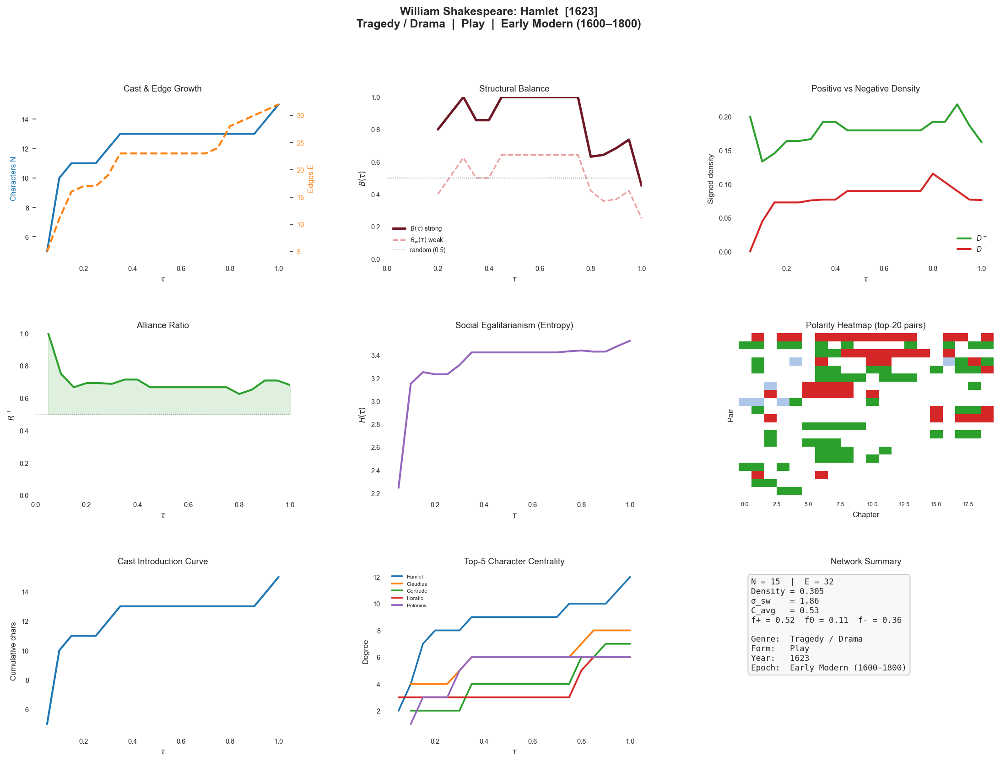
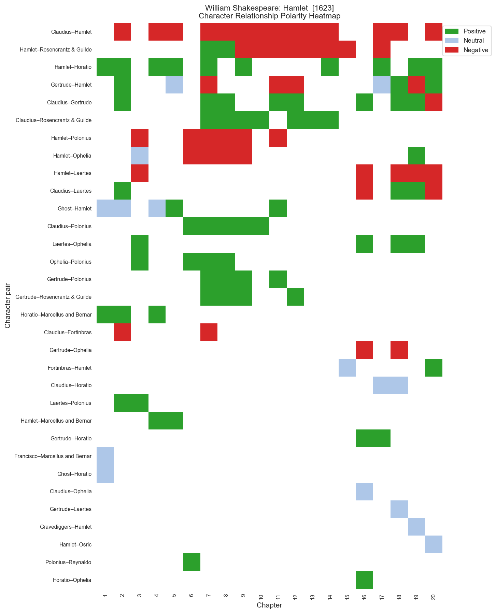
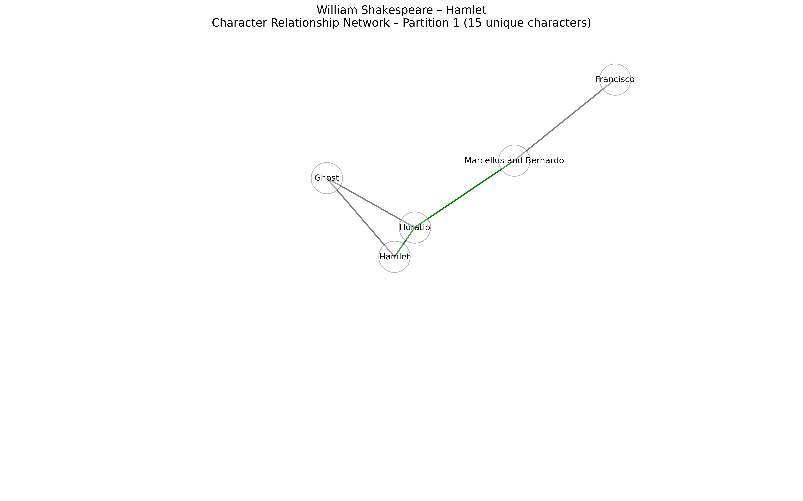
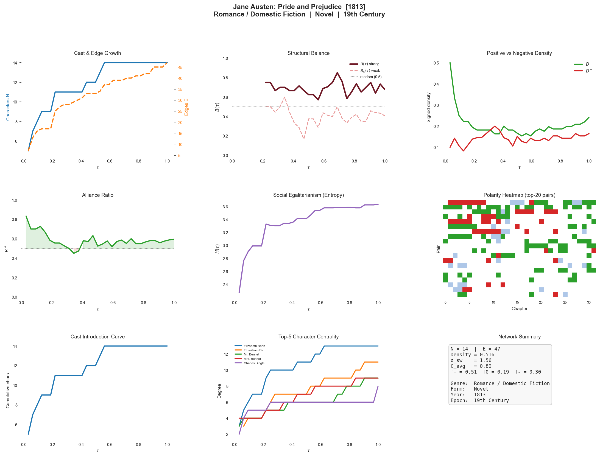
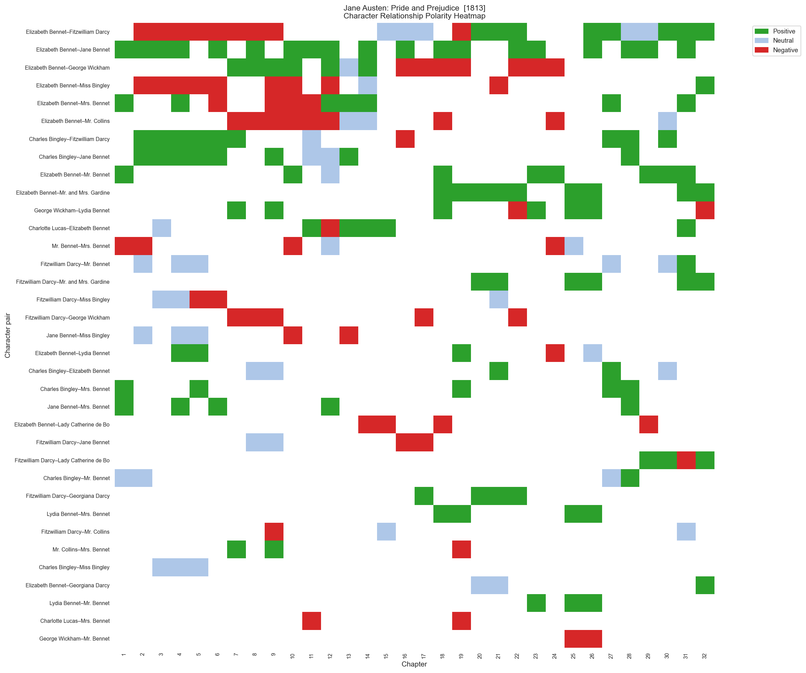
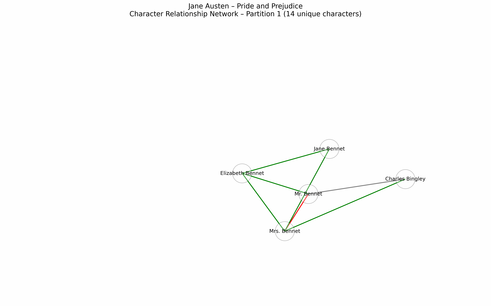
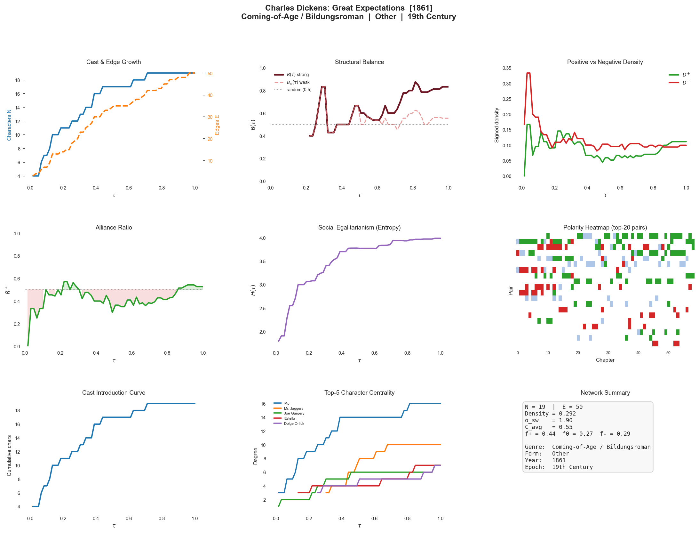
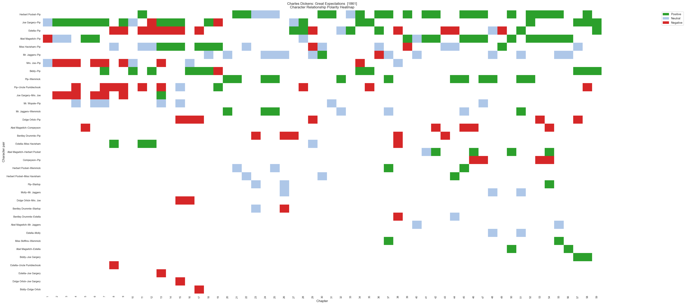
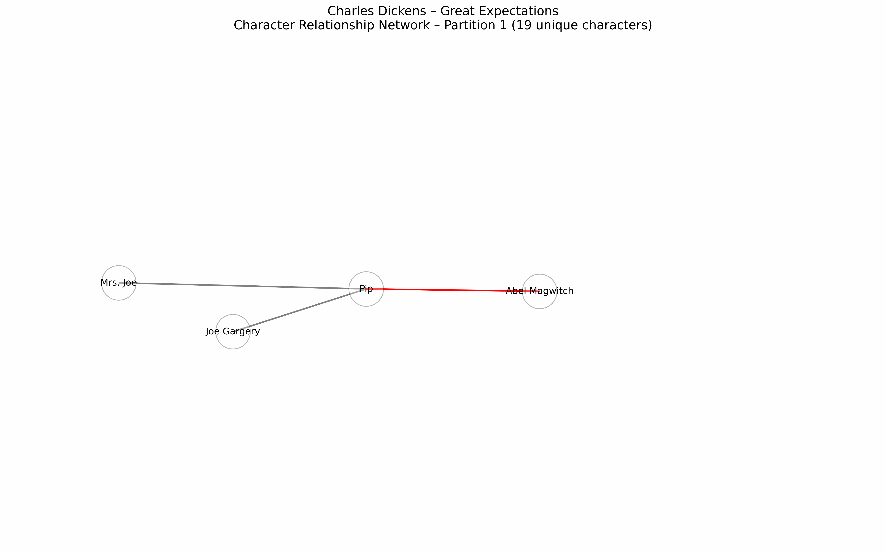

# Temporal Dynamics of Social Balance in Fictional Character Networks

[](https://github.com/L-Earthling/litnet-balance/releases/latest)
[](https://creativecommons.org/licenses/by/4.0/)
[](LICENSE)
[](https://www.python.org/)
[](thesis/Ivanova_2026_Temporal_Dynamics_Social_Balance.pdf)

> **MSc Thesis** — Larisa Ivanova · Saarland University / DFKI · 2026  
> Supervisor: Dr. rer. nat. Gerrit Großmann · Reviewers: Prof. Dr. Stefania Degaetano-Ortlieb, MSc. Sofía Aguilar

---

> **TL;DR** — This dataset comprises **873 temporal signed character networks** extracted from literary works, spanning 8 genres and 6 historical epochs. Each network tracks character relationships (positive / negative / neutral) at chapter-level resolution. Fictional social worlds obey real-world network laws (small-world structure, superlinear densification); structural balance is persistently high, genre-stratified, and temporally stable — with a non-monotonic U-shaped historical arc that peaks in Pre-Modern and 21st-Century fiction.

---

## Table of Contents

1. [What Are Temporal Signed Character Networks?](#1-what-are-temporal-signed-character-networks)
2. [Pipeline Overview](#2-pipeline-overview)
3. [Dataset](#3-dataset)
4. [Key Findings](#4-key-findings)
5. [Case Studies: Per-Book Profiles](#5-case-studies-per-book-profiles)
6. [Metrics and Parameters](#6-metrics-and-parameters)
7. [Repository Structure](#7-repository-structure)
8. [Getting Started](#8-getting-started)
9. [Citation](#9-citation)
10. [License](#10-license)

---

## 1. What Are Temporal Signed Character Networks?

Literary narratives are bounded, intentionally constructed social systems. Characters form alliances, rivalries emerge and resolve, and relationships evolve across chapters in ways that stylize real-world social dynamics.

This project operationalizes these dynamics as **temporal signed networks**: one network per literary work, updated chapter by chapter.

- **Nodes** — named characters
- **Edges** — character relationships labeled `positive`, `negative`, or `neutral`
- **Time** — chapter index, normalized to τ ∈ (0, 1]
- **Polarity convention** — *most-recent-wins*: if two characters are allies in chapter 3 but enemies in chapter 7, the edge is coded as negative from chapter 7 onward

Relationships were extracted from publicly available chapter-level book summaries using **Meta Llama-3.3-70B-Instruct** via an automated LLM pipeline.

---

## 2. Pipeline Overview


The pipeline proceeds in three stages:

**Stage 1 — Data collection.** Chapter-level narrative summaries and curated character lists are collected from online literary study guides. Each work is stored as two structured plain-text files: a summary file (chapter partitions delimited by `=== PARTITION N: [Title] ===`) and a character file (MAJOR / MINOR sections with canonical names).

**Stage 2 — LLM extraction** (`scripts/network_extraction.ipynb`). Each chapter partition is processed by **Meta Llama-3.3-70B-Instruct** (via AcademicCloud and DeepInfra APIs), yielding signed edge tuples (A, B, σ, t) with σ ∈ {positive, negative, neutral}. The pipeline is crash-resilient (SQLite progress tracking), supports deterministic resume, and rotates across multiple API keys.

**Stage 3 — Network construction and analysis** (`scripts/analysis/network_analysis.ipynb`). The graph builder assembles cumulative signed graphs G₁, …, G_T under a most-recent-wins convention. Per-book 142-dimensional feature vectors are extracted. Analysis blocks cover: static network metrics (A), temporal dynamics (B), structural balance (C), temporal motifs (D), genre classification (E), epoch stratification (F), and per-book case studies (G).

**Processing time:** approximately 132 hours total on consumer hardware (Apple MacBook Pro, M-series chip). No GPU required.

---

## 3. Dataset

### Download

**[→ Download Dataset v1 (networks + metadata, .zip)](https://github.com/L-Earthling/litnet-balance/releases/latest)**

Or use the files directly from the `data/` folder in this repository.

### `combined_networks_all.csv` — Character relationship edges

109,855 rows × 6 columns. One row = one character-pair observation in one chapter.

| Column | Description |
|---|---|
| `Book` | `"Author: Title"` — unique book identifier |
| `Chapter` | Chapter number (1-indexed) |
| `Character A` | First character (canonical name from curated cast list) |
| `Character B` | Second character |
| `Relationship` | `positive`, `negative`, or `neutral` |
| `source` | Source corpus (`sparknotes` or `litcharts`) |

### `combined_metadata_all.csv` — Per-work metadata

900 rows × 9 columns. One row per literary work.

| Column | Description |
|---|---|
| `Author` | Author name |
| `Book` | Title |
| `Year` | Year of first publication |
| `Epoch` | Historical epoch (6 categories) |
| `Genre_Primary` | Primary genre label (8 categories) |
| `Genre_Secondary` | Secondary genre label (where applicable) |
| `Form` | `Novel`, `Play`, or `Other` |
| `Remarks` | Curation notes (edge cases, non-fiction flags) |
| `source` | Source corpus |

### Corpus at a glance

| Statistic | Value |
|---|---|
| Works (after quality filtering) | 873 |
| Total character-relationship observations | 109,855 |
| Authors | 544 |
| Genres | 8 |
| Historical epochs | 6 |
| Median cast size | 16 characters |
| Median chapter count | 16 |
| Median edges per work | 29 |

**Genre distribution:**

| Genre | n | Dominant form |
|---|---|---|
| Literary / Realist Fiction | 286 | Novel |
| Coming-of-Age / Bildungsroman | 107 | Novel |
| Tragedy / Drama | 85 | Play (91.8%) |
| Fantasy / Adventure | 65 | Novel |
| Science Fiction / Dystopia | 52 | Novel |
| Comedy / Satire | 48 | Play (66.7%) |
| Mystery / Thriller | 47 | Novel |
| Romance / Domestic Fiction | 36 | Novel |

> ⚠️ **Form–genre confound:** Tragedy/Drama and Comedy/Satire are play-dominated; all other genres are predominantly novels. Plays have smaller, more densely interconnected casts. Cross-genre structural comparisons involving these two genres must be interpreted with caution. See the [thesis](thesis/Ivanova_2026_Temporal_Dynamics_Social_Balance.pdf) (§VIII.3) for full discussion.

---

## 4. Key Findings

### RQ1 — Universal small-world structure and superlinear densification

Of 696 works with sufficient density, **99.3%** satisfy σ_sw > 1 (corpus median σ_sw = 2.83), confirming universal small-world structure. The corpus-wide median densification exponent is **α = 1.48** (97.1% of books yield α > 1): each newly introduced character forms, on average, more than one relationship with the existing cast — mirroring laws documented in empirical social networks.

### RQ2 — Structural balance: persistently high, temporally flat, genre-stratified

The strong-balance index B(τ) lies in [0.65, 0.84] across all genres and narrative positions, far above the B = 0.50 expectation for a randomly signed network. **No genre shows a systematic monotone trend.** Social-structural complexity is established early and maintained throughout.

Genre differences are statistically reliable (Kruskal–Wallis H = 38.8, p = 2.1 × 10⁻⁶, η² = 0.062) but partly attributable to the play/novel form distinction. The global median per-book argmin of B(τ) falls at **τ\* = 0.667**, within the Freytag climax window [0.60, 0.75] (KS non-uniformity p < 10⁻⁶).

An exploratory **U-shaped epoch effect** (ΔB ≈ 0.10–0.12) reveals that Pre-Modern and 21st-Century works occupy the highest balance band, while 19th- and Early 20th-Century works (realism and modernism) occupy the lowest — a magnitude comparable to the genre effect.

### RQ3 — Stable motifs dominate; genre-specific patterns detectable

Stable-alliance (+++) and stable-enmity (−−−) motifs together account for **76–87%** of all length-3 polarity sequences. Comedy/Satire shows the highest reconciliation rate (−−+ = 0.047); Tragedy/Drama is the only genre where antagonism rivals alliance in base rate (−−− = 0.404, +++ = 0.389).

### RQ4 — Genre classification: modest but reliable signal

Random Forest macro-F1 = **0.139** on the full corpus (stratified baseline: 0.127; L1 Logistic Regression: 0.196). Entropy trajectory features dominate the top predictors; no B(τ) features appear in the top 10. Weak classification reflects genuine structural overlap among genres, not pipeline failure.

### Validation against human annotations

Benchmarked against majority-vote human annotations from [Massey et al. (2015)](https://arxiv.org/abs/1512.00728): macro-F1 = **0.58** on 966 matched character pairs across 91 works — within the inter-annotator agreement range (κ ≈ 0.65).

---

## 5. Case Studies: Per-Book Profiles

Three works were selected to illustrate how corpus-level findings manifest at the level of individual books — one per genre. Each profile shows the temporal evolution of the signed character network, the structural balance trajectory B(τ), and the full per-chapter relationship polarity heatmap. Detailed written analyses are in [Appendix C of the thesis](thesis/Ivanova_2026_Temporal_Dynamics_Social_Balance.pdf).

---

### *Hamlet* — Shakespeare (1623) · Tragedy/Drama · Play

> N = 15 characters · E = 32 edges · T = 20 chapters · σ_sw = 1.86

B(τ) stays at **1.0** from τ = 0.25 to τ = 0.75 — the court of Elsinore locks into a stable two-faction configuration. Five simultaneous sign flips in the final chapter collapse balance to **B = 0.45**, the most dramatic late-narrative structural breakdown in the corpus. Per-book argmin τ\* = 1.0 — an outlier relative to the corpus median of 0.667, reflecting the Shakespearean convention that social dissolution concentrates in the denouement.

| | |
|---|---|
|  |  |

<p align="center">
  
  <br><i>Temporal evolution of the signed character network across 20 partitions</i>
</p>

---

### *Pride and Prejudice* — Austen (1813) · Romance/Domestic Fiction · Novel

> N = 14 characters · E = 47 edges · T = 32 chapters · σ_sw = 1.56

The highest positive-edge fraction of the three case studies (f⁺ = 0.51). B(τ) oscillates in [0.50, 0.85] throughout — high and flat in aggregate, but driven by continuous dyadic reorganization at the pair level. The Elizabeth Bennet–Fitzwilliam Darcy edge cycles through four sign states (negative → neutral → negative → positive), the textbook reconciliation arc of the Romance genre. Per-book argmin τ\* = 0.156, consistent with the Romance genre median of 0.654: peak tension arrives early and the narrative resolves it.

| | |
|---|---|
|  |  |

<p align="center">
  
  <br><i>Temporal evolution of the signed character network across 32 partitions</i>
</p>

---

### *Great Expectations* — Dickens (1861) · Coming-of-Age/Bildungsroman · Novel

> N = 19 characters · E = 50 edges · T = 59 chapters · σ_sw = 1.90

The corpus's clearest U-shaped B(τ) arc. Balance begins at 0.833, drops to a minimum of **0.400** at τ\* = 0.22 (Pip's period of maximum social dislocation), then recovers monotonically to **0.833** by τ = 1.0. The Estella–Pip edge records five sign changes across 59 chapters — the highest dyadic volatility of the three case studies. Degree entropy grows from H = 2.0 to 4.0, reflecting Pip's progressive social integration as he moves from the marshes to London.

| | |
|---|---|
|  |  |

<p align="center">
  
  <br><i>Temporal evolution of the signed character network across 59 partitions</i>
</p>

---

## 6. Metrics and Parameters

### Static network metrics (computed on the terminal cumulative graph G_T)

| Metric | Symbol | Description |
|---|---|---|
| Cast size | N | Number of distinct characters |
| Edge count | E | Number of unique character pairs |
| Density | δ = 2E / N(N−1) | Fraction of possible edges realized |
| Avg. clustering | C_avg | Mean local clustering coefficient |
| Avg. path length | L | Mean shortest path over the largest connected component |
| Small-world coeff. | σ_sw = (C/C_rand) / (L/L_rand) | σ_sw > 1 indicates small-world structure |
| Positive fraction | f⁺ | Fraction of edges labeled positive |
| Negative fraction | f⁻ | Fraction of edges labeled negative |

### Temporal network metrics (computed at each cumulative snapshot G_1 … G_T)

| Metric | Symbol | Description |
|---|---|---|
| Network density | D(τ) | δ evaluated at narrative position τ |
| Positive density | D⁺(τ) | n_pos(τ) / C(N,2) |
| Negative density | D⁻(τ) | n_neg(τ) / C(N,2) |
| Alliance ratio | R⁺(τ) = D⁺/(D⁺+D⁻) | Fraction of signed edges that are positive |
| Degree entropy | H(τ) | Shannon entropy of the degree distribution |
| Avg. clustering | C(τ) | Mean local clustering at snapshot τ |
| Densification exponent | α (from E ∝ N^α) | α > 1 = superlinear densification |
| Edge volatility | — | Fraction of edges that change polarity between consecutive chapters |
| Burstiness | κ = (σ_Δ − μ_Δ)/(σ_Δ + μ_Δ) | κ < 0 = more regular than Poisson; κ > 0 = bursty |

### Structural balance metrics

| Metric | Description |
|---|---|
| Balance index | B(τ) = fraction of closed signed triads that are balanced (+++ or +−−) |
| Weak balance | B_w(τ) = fraction of triads satisfying the weaker Harary (1953) criterion (+−− only) |
| Minimum balance position | τ\* = argmin B(τ) — narrative position of peak social tension |
| End-minus-start balance | ΔB = B(τ=1) − B(τ=0) |
| Triad types | f_+++ , f_++− , f_+−− , f_−−− (fractions of the four signed triad types) |

### Temporal interaction motifs

Length-3 polarity sequences on recurring character pairs (neutral edges excluded):

| Motif | Label | Interpretation |
|---|---|---|
| `+++` | Stable alliance | Relationship maintains positive polarity |
| `---` | Stable enmity | Relationship maintains negative polarity |
| `+--` | Alliance collapse | Friendship turns to lasting enmity |
| `--+` | Reconciliation | Conflict resolves to positive |
| `++-` | Drift to conflict | Friendship gradually turns antagonistic |
| `-++` | Drift to alliance | Conflict gradually resolves |
| `+-+` | Betrayal–reconciliation | Temporary rupture of an alliance |
| `-+-` | Truce–relapse | Temporary resolution of a conflict |

### Key parameters

| Parameter | Value | Description |
|---|---|---|
| Narrative time bins | 10 equispaced bins at τ ∈ {0.05, 0.15, …, 0.95} | Used for trajectory interpolation |
| Balance threshold | ≥ 5 signed triads per snapshot | Minimum for B(τ) to be computed |
| Small-world threshold | σ_sw > 1 | Condition for small-world classification |
| Motif length | 3 | Length of polarity sequences extracted |
| LLM temperature | 0.1 | Near-deterministic extraction |
| CV folds | 10-fold stratified | Genre classification cross-validation |
| RF trees | 500 | Random Forest ensemble size |
| Feature vector | 142 dimensions | 7 metrics × 19 features + 9 scalar features |

---

## 7. Repository Structure

```
litnet-balance/
├── README.md                          # This file
├── LICENSE                            # MIT License (code)
├── LICENSE-DATA.md                    # CC BY 4.0 (dataset)
│
├── data/
│   ├── README.md                      # Data documentation
│   ├── combined_networks_all.csv      # 109,855 character-relationship edges
│   └── combined_metadata_all.csv     # 900-row per-work metadata
│
├── scripts/
│   ├── README.md                      # Script documentation and setup guide
│   ├── network_extraction.ipynb       # LLM extraction pipeline (key rotation, crash resilience)
│   ├── requirements.txt               # Python dependencies
│   └── analysis/
│       └── network_analysis.ipynb     # Full analysis notebook (873 books)
│
├── figures/
│   ├── README.md
│   ├── pipeline_overview.png
│   ├── balance_trajectory_by_genre.png
│   ├── motif_analysis.png
│   ├── confusion_matrix.png
│   ├── feature_importance.png
│   ├── tsne_genre.png
│   ├── balance_by_epoch.png
│   ├── smallworld_sigma_distribution.png
│   └── case_studies/
│       ├── hamlet_profile.png
│       ├── hamlet_heatmap.png
│       ├── hamlet_network.gif
│       ├── pride_prejudice_profile.png
│       ├── pride_prejudice_heatmap.png
│       ├── pride_prejudice_network.gif
│       ├── great_expectations_profile.png
│       ├── great_expectations_heatmap.png
│       └── great_expectations_network.gif
│
└── thesis/
    └── Ivanova_2026_Temporal_Dynamics_Social_Balance.pdf
```

---

## 8. Getting Started

### Requirements

Python 3.12. Install dependencies:

```bash
pip install -r scripts/requirements.txt
```

Or individually:

```bash
pip install pandas numpy networkx scikit-learn matplotlib seaborn tqdm openai
```

### Load the dataset

```python
import pandas as pd

# Character-relationship edges
df = pd.read_csv("data/combined_networks_all.csv")

# Per-work metadata
meta = pd.read_csv("data/combined_metadata_all.csv")

# Merge for analysis
meta["BookKey"] = meta["Author"] + ": " + meta["Book"]
df_merged = df.merge(meta, left_on="Book", right_on="BookKey", how="left")

print(f"Corpus: {df['Book'].nunique()} works, {len(df):,} edges")
```

### Reproduce the analysis

Open `scripts/analysis/network_analysis.ipynb` in Jupyter. Run blocks in order:
**Block 0 → 1 → A → B → C → D → E → F → H → G**

Each block is self-contained with section headers and inline comments.
Before running, edit the two path variables at the top of Block 0 to point to your local copies of `data/combined_networks_all.csv` and `data/combined_metadata_all.csv`.

### Re-run extraction

Open `scripts/network_extraction.ipynb`. Set API keys as environment variables before running — do not hardcode them:

```bash
export ACADEMICCLOUD_KEY_1="your_key_here"
export DEEPINFRA_KEY_1="your_key_here"
```

See `scripts/README.md` for full setup instructions and supported endpoints.

---

## 9. Citation

If you use this dataset or code, please cite:

```bibtex
@mastersthesis{ivanova2026temporal,
  author    = {Larisa Ivanova},
  title     = {Temporal Dynamics of Social Balance in Fictional Character Networks},
  school    = {Saarland University},
  year      = {2026},
  type      = {MSc Thesis},
  url       = {https://github.com/L-Earthling/litnet-balance},
  note      = {Department of Language Science and Technology / DFKI}
}
```

---

## 10. License

**Code** (`scripts/`): [MIT License](LICENSE)

**Dataset** (`data/`): [Creative Commons Attribution 4.0 International (CC BY 4.0)](LICENSE-DATA.md)

**Thesis PDF** (`thesis/`): © Larisa Ivanova, 2026. All rights reserved. Shared here for academic reference only.
